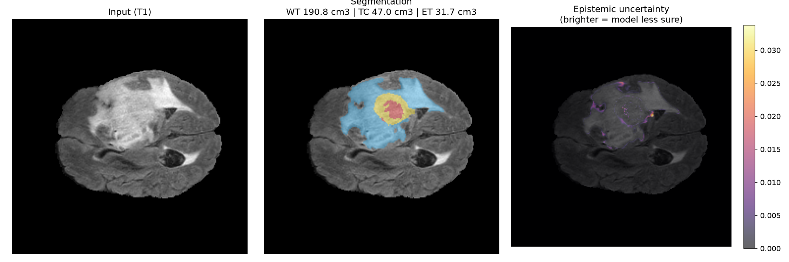
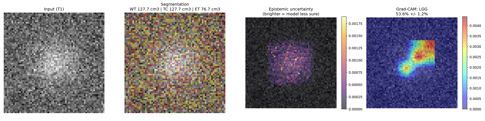
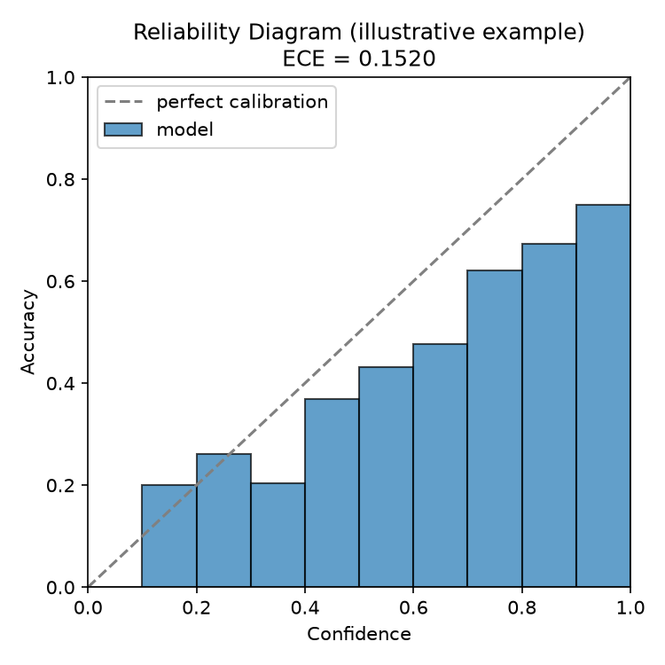
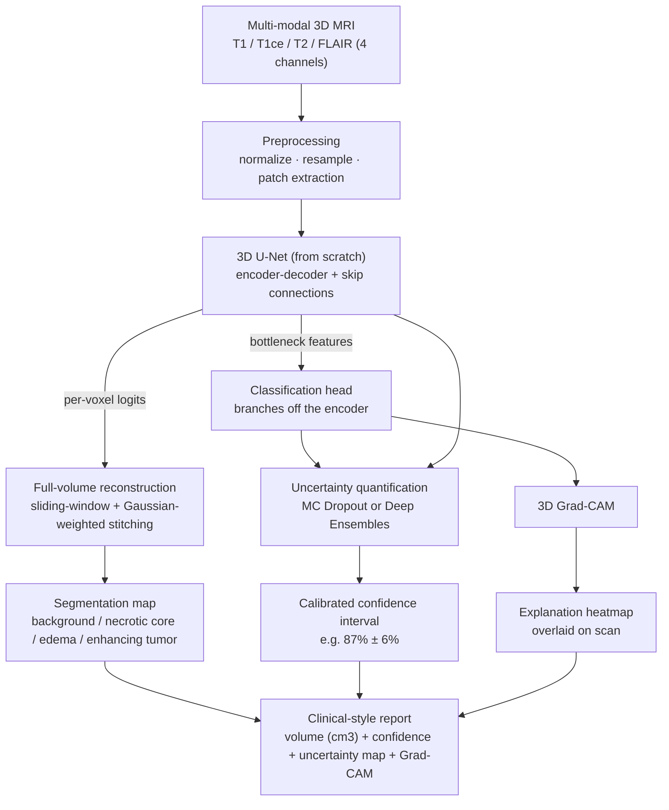

# 3D Tumor Segmentation + Uncertainty Quantification

Input: a multi-modal 3D MRI brain scan (T1, T1ce, T2, FLAIR). Output: a voxel-level 3D
segmentation of the tumor and its subregions, plus a **voxel-level uncertainty map** —
not just where the tumor is, but where the model itself isn't sure. Most portfolio
medical-imaging projects stop at "trained a U-Net, got a Dice score." This one adds
the thing that actually matters for a model a radiologist could audit: it knows *when*
it doesn't know, via genuine uncertainty quantification (Monte Carlo Dropout), not a
decorative softmax number.

Trained/evaluated on **[BraTS](http://braintumorsegmentation.org/)** (Brain Tumor
Segmentation Challenge) — see [scripts/download_data.md](scripts/download_data.md)
for how to get the data.

> **Status:** the 3D U-Net has been trained to convergence (200 epochs, real GPU run)
> on real BraTS2020 data (369 cases) — see [Results](#results) for real held-out Dice
> scores and a real segmentation + uncertainty report.
>
> **Scope note on classification/Grad-CAM:** the codebase also implements a
> classification head, calibrated-confidence uncertainty, and 3D Grad-CAM (see
> [Architecture](#architecture)) — a malignancy/subtype call with a confidence
> interval and an explanation heatmap, per the original design. **These are
> implemented and unit-tested (see [tests/](tests/)) but not trained**: the Kaggle
> BraTS2020 download used here doesn't ship real tumor grade/subtype labels, and this
> project does not train on invented ones. The moment real labels are available (see
> `scripts/download_data.md` Option C), `scripts/train_classifier.py` runs as-is
> against this same trained encoder. Until then, the segmentation + uncertainty
> pipeline below is the real, trained deliverable.

## Sample report output — real trained model, real held-out scan



Generated by `src/report.py` on `volume_1`, a case the model never saw during training
— left to right: input T1 modality, segmentation overlay (edema in blue, necrotic core
in red, enhancing tumor in yellow) with per-region volume in cm³, and voxel-level
epistemic uncertainty from Monte Carlo Dropout. Notice the uncertainty concentrates
right at the tumor boundary, not scattered randomly — exactly the pattern you'd want:
the model is most unsure precisely where the ground truth itself is most ambiguous.
Reproduce it yourself:

```bash
python scripts/generate_report.py \
  --seg_checkpoint checkpoints/segmentation/best.pt \
  --case_id volume_1 \
  --output outputs/reports/report.png
```

Pass `--cls_checkpoint checkpoints/classifier/best.pt` once a real classifier is
trained (see the scope note above) to add a 4th panel with the classification decision
and its Grad-CAM explanation. The illustrative version of that full 4-panel layout
(synthetic data, random weights, just to show the format) is still available:



```bash
python scripts/generate_preview_assets.py
```

## Calibration check (illustrative example)



There's no ground-truth "uncertainty" to check predictions against directly, so the
standard proxy is calibration: does the model's stated 80% confidence actually
correspond to being right 80% of the time? The example above (synthetic, deliberately
overconfident data) shows what a *miscalibrated* model looks like — bars below the
diagonal mean the model is more confident than it should be. `src/metrics.py` produces
this plot plus Expected Calibration Error (ECE) from real predictions once trained.

## Architecture



## Project layout

```
config.yaml                  all hyperparameters in one place
requirements.txt
app.py                       Streamlit demo (see Demo section below)

src/
  data/dataset.py            BraTS case discovery + MONAI transforms (nifti and h5_slices formats)
  models/unet3d.py           3D U-Net, implemented from scratch
  models/classifier.py       classification head branching off the U-Net bottleneck
  losses.py                  Dice + cross-entropy combo loss, class weighting
  inference.py                sliding-window full-volume inference, Gaussian-weighted stitching
  uncertainty.py              Monte Carlo Dropout + Deep Ensemble aggregation
  gradcam3d.py                 3D Grad-CAM
  metrics.py                  per-subregion Dice, calibration / reliability diagram
  report.py                    combined report generator (seg + confidence + uncertainty + Grad-CAM)
  utils.py                     seeding, checkpointing, mask-overlay visualization

scripts/
  download_data.md            how to get BraTS data (3 routes, see below)
  train_segmentation.py       train the 3D U-Net
  train_classifier.py         train the classification head on a pretrained encoder
  evaluate.py                 full-volume Dice evaluation on the held-out split
  generate_report.py          run one case through the full pipeline, save the report figure
  generate_preview_assets.py  regenerate this README's illustrative images (no data needed)
  export_demo_cases.py        export held-out cases for the Streamlit demo's example-case dropdown

tests/                         synthetic-tensor sanity tests (no BraTS data required)
config.yaml                    full-scale config (h5_slices format by default)
config_cpu_smoketest.yaml      small/fast config for verifying the pipeline on a CPU-only machine
assets/                        README images
```

## Setup

```bash
git clone https://github.com/manahillllll/medical-cv-tumor-segmentation.git
cd medical-cv-tumor-segmentation
python -m venv .venv
source .venv/bin/activate        # Windows: .venv\Scripts\activate
pip install -r requirements.txt
```

## Quick check it works (no data needed, ~10 seconds)

```bash
pytest tests/ -v
```

This runs the full model/loss/sliding-window-inference/uncertainty/Grad-CAM/data-pipeline
stack on synthetic tensors (including a synthetic `.h5` case) and confirms every shape
and gradient path is correct before you spend time on real training.

## Getting the data

See [scripts/download_data.md](scripts/download_data.md) for the full walkthrough —
three routes depending on what you need (fastest download vs. classification labels).
This repo's `config.yaml` defaults to `data.format: "h5_slices"`, matching the
[Kaggle "BraTS2020 Training Data"](https://www.kaggle.com/datasets/awsaf49/brats20-dataset-training-validation)
repackaging (one `.h5` file per 2D slice rather than one NIfTI volume per modality);
`format: "nifti"` is also supported for the official BraTS release or MONAI's
auto-downloadable Decathlon mirror.

**Data license note:** the official BraTS releases distributed via Synapse (e.g. the
BraTS 2023 Challenge data, Synapse project `syn51156910`) are **CC-BY-NC 4.0 —
non-commercial use only**, and require the following attribution in any resulting
publication/writeup:

> Data used in this publication were obtained as part of the Brain Tumor Segmentation
> (BraTS) Challenge project through Synapse ID: syn51156910.

...plus citations to the BraTS flagship and challenge-specific manuscripts (listed on
Synapse's Data Access/Downloads page) if you refer to the dataset in research output.
See [scripts/download_data.md](scripts/download_data.md) for details and the
Kaggle-repackaged data's own separate terms.

No GPU yet? `config_cpu_smoketest.yaml` runs the identical pipeline at a much smaller
scale so you can confirm real data loads and trains correctly in a couple of minutes
on a CPU-only machine:
```bash
python scripts/train_segmentation.py --config config_cpu_smoketest.yaml
```

## Running the full pipeline

1. **Segmentation sanity check** (confirm the model can overfit a single batch
   before committing to a full run — set `train_segmentation.overfit_single_batch: true`
   in `config.yaml`, then run the command below; flip it back to `false` afterward):
   ```bash
   python scripts/train_segmentation.py --config config.yaml
   ```
2. **Full segmentation training** (checkpoints land in `checkpoints/segmentation/`):
   ```bash
   python scripts/train_segmentation.py --config config.yaml
   ```
3. **Evaluate segmentation** — per-subregion Dice (Whole Tumor / Tumor Core /
   Enhancing Tumor, the standard BraTS reporting regions):
   ```bash
   python scripts/evaluate.py --checkpoint checkpoints/segmentation/best.pt
   ```
4. **Generate a report** for one case (segmentation overlay + uncertainty heatmap):
   ```bash
   python scripts/generate_report.py \
     --seg_checkpoint checkpoints/segmentation/best.pt \
     --case_id volume_1
   ```
5. **(Once you have real grade/subtype labels)** train the classifier on top of the
   pretrained encoder — see `download_data.md` Option C for where real labels come
   from; this repo does not train on invented ones:
   ```bash
   python scripts/train_classifier.py --labels_csv data/labels.csv
   ```
   Then pass `--cls_checkpoint checkpoints/classifier/best.pt` to
   `generate_report.py` to add the classification + confidence interval + Grad-CAM panel.

All hyperparameters (patch size, batch size, learning rate, dropout, MC-sample count,
data format/path, etc.) live in `config.yaml` — edit that rather than script flags.

## Demo (Streamlit app)

An interactive local demo — pick a scan, run real segmentation + uncertainty
inference, scrub through slices, compare against ground truth.

```bash
# one-time: export a handful of held-out cases for the "example case" dropdown
# (not committed to the repo -- built locally from data you already downloaded)
python scripts/export_demo_cases.py --config config.yaml --n_cases 5

streamlit run app.py
```

Two ways to get a scan in:
- **Example case** — pick from the exported held-out cases; shows the model's
  prediction next to the real ground truth and per-region Dice for that case.
- **Upload your own scan** — four NIfTI files (FLAIR, T1, T1ce, T2). Runs through the
  same MONAI preprocessing pipeline used everywhere else in this repo.

Requires `checkpoints/segmentation/best.pt` to exist (train it first, or use your own
checkpoint at that path). No classifier ships with this project (see the scope note
above), so the demo shows segmentation + voxel-level uncertainty only.

## Why uncertainty and explainability matter here

A confident-but-wrong model is more dangerous in a clinical setting than a model that
knows it's unsure — a radiologist reviewing model output needs to know *which* cases
to double-check, not just what the model's best guess was. `src/uncertainty.py`
implements both options: Monte Carlo Dropout (cheap — run inference N times with
dropout active, use the variance across runs) and Deep Ensembles (more robust — train
3-5 independently-initialized models, use their disagreement).

Explainability (`src/gradcam3d.py`) answers a different question: *why* did the model
make this call. The sanity check is qualitative — on cases where you already know the
tumor location, does the heatmap actually land on the tumor, or is it looking at the
skull or background? If the latter, something upstream is wrong.

## Results

Trained on a single NVIDIA RTX 4080 (12GB), 200 epochs, real BraTS2020 data (369
cases, 314 train / 55 held-out val, `format: "h5_slices"`). Full held-out evaluation
(`scripts/evaluate.py`, sliding-window inference + Gaussian stitching across all 55
val cases, best checkpoint at epoch 179):

| Region | Dice |
|---|---|
| Whole Tumor (WT) | **0.901** |
| Tumor Core (TC) | **0.876** |
| Enhancing Tumor (ET) | **0.761** |

Per-class Dice: background 0.999, necrotic core 0.712, edema 0.796, enhancing tumor
0.761. These are competitive with published BraTS2020 baselines for a from-scratch,
single-model (no ensembling, no test-time augmentation), single-fold training run —
Enhancing Tumor trailing Whole Tumor/Tumor Core is the expected pattern, since it's
the smallest and most ambiguous subregion.

The classification head remains untrained (see the scope note above) — the Kaggle
`h5_slices` download doesn't ship the official HGG/LGG grade label, and this project
does not train on invented ones. `scripts/train_classifier.py` and the report's
classification/Grad-CAM panel are implemented and unit-tested, ready to run the moment
a real grade label is available per `scripts/download_data.md` Option C.

_A real reliability diagram / ECE will follow once the classifier is actually
trained — calibration is a classification-confidence concept, so there's nothing
meaningful to calibrate without it._

## Implemented from scratch vs. off-the-shelf

**From scratch:** the 3D U-Net architecture, the Dice+CE combo loss with class
weighting, patch-based training + sliding-window inference with Gaussian-weighted
stitching, MC Dropout / ensemble uncertainty aggregation, 3D Grad-CAM, and the
report-generation pipeline.

**Off-the-shelf:** MONAI's data loading/augmentation transforms (resampling,
intensity normalization, positive/negative patch sampling), nibabel/SimpleITK for
NIfTI I/O — this plumbing is well-solved and not the interesting part to reimplement.

## The hard parts (and how this repo handles them)

- **GPU memory** — 3D convs on full volumes don't fit; training runs on
  `data.patch_size` patches (default 128³), tune this and `train_segmentation.batch_size`
  to your GPU.
- **Class imbalance** — background is >95% of voxels; `src/losses.py::compute_class_weights`
  gives inverse-frequency weights fed into both the Dice and cross-entropy terms, and
  `RandCropByPosNegLabeld` oversamples tumor-containing patches during training.
- **Patch stitching seams** — `src/inference.py` blends overlapping patch predictions
  with a Gaussian weighting window centered on each patch rather than naive averaging,
  which avoids visible grid artifacts at patch boundaries.
- **Evaluating uncertainty** — no single ground truth to check against; use calibration
  (reliability diagram / ECE) as the proxy, per above.
- **3D Grad-CAM** — no standard drop-in library; `src/gradcam3d.py` extends the
  standard 2D formulation's pooling/upsampling to volumetric tensors directly.
