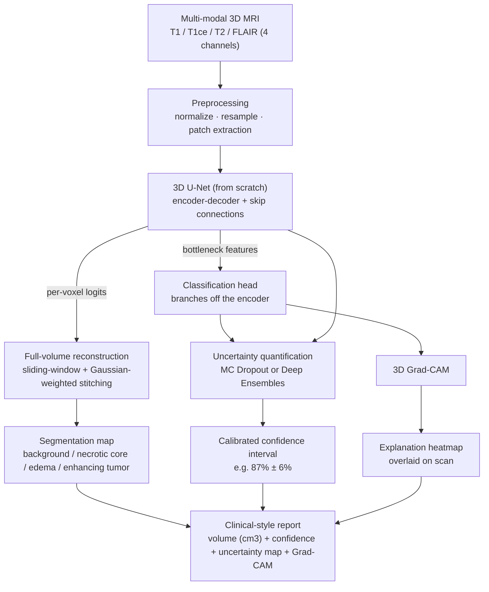

# 3D Tumor Segmentation + Uncertainty-Aware Diagnosis with Explainability

Input: a multi-modal 3D MRI brain scan (T1, T1ce, T2, FLAIR). Output:

1. a voxel-level 3D segmentation of the tumor and its subregions,
2. a malignancy/subtype classification with a **calibrated confidence interval** — not
   just a softmax number, but genuine uncertainty quantification, and
3. a **Grad-CAM heatmap** showing which regions of the scan drove the classification.

Most portfolio medical-imaging projects stop at "trained a U-Net, got a Dice score."
This one adds the two things that actually matter for a model a radiologist could
audit: it knows *when* it doesn't know (uncertainty quantification), and it can show
its work (explainability).

Trained/evaluated on **[BraTS](http://braintumorsegmentation.org/)** (Brain Tumor
Segmentation Challenge) — see [scripts/download_data.md](scripts/download_data.md)
for how to get the data.

> **Status:** the pipeline (model, losses, training, sliding-window inference,
> uncertainty, Grad-CAM, report generation) is implemented and covered by
> [tests/test_shapes.py](tests/test_shapes.py) — all 17 sanity tests pass on synthetic
> data. It has not yet been trained on real BraTS data. The images below are generated
> by the actual report pipeline on synthetic input and randomly-initialized (untrained)
> weights, purely to show the *output format* — see [Results](#results) for where
> real numbers will go once training is done.

## Sample report output (illustrative — untrained weights, synthetic data)


Generated by `src/report.py` — left to right: input modality, segmentation overlay
with per-region tumor volume in cm³, voxel-level epistemic uncertainty (Monte Carlo
Dropout), and the Grad-CAM explanation for the predicted class with its confidence
interval. Regenerate this exact figure (on synthetic data, no BraTS download needed)
with:

```bash
python scripts/generate_preview_assets.py
```

## Calibration check (illustrative example)


There's no ground-truth "uncertainty" to check predictions against directly, so the
standard proxy is calibration: does the model's stated 80% confidence actually
correspond to being right 80% of the time? The example above (synthetic, deliberately
overconfident data) shows what a *miscalibrated* model looks like — bars below the
diagonal mean the model is more confident than it should be. `src/metrics.py` produces
this plot plus Expected Calibration Error (ECE) from real predictions once trained.

## Architecture



## Project layout

```
config.yaml                  all hyperparameters in one place
requirements.txt

src/
  data/dataset.py            BraTS case discovery + MONAI transforms (load, normalize, patch-sample)
  models/unet3d.py           3D U-Net, implemented from scratch
  models/classifier.py       classification head branching off the U-Net bottleneck
  losses.py                  Dice + cross-entropy combo loss, class weighting
  inference.py                sliding-window full-volume inference, Gaussian-weighted stitching
  uncertainty.py              Monte Carlo Dropout + Deep Ensemble aggregation
  gradcam3d.py                 3D Grad-CAM
  metrics.py                  per-subregion Dice, calibration / reliability diagram
  report.py                    combined report generator (seg + confidence + uncertainty + Grad-CAM)
  utils.py                     seeding, checkpointing, mask-overlay visualization

scripts/
  download_data.md            how to get BraTS data (two routes, see below)
  train_segmentation.py       train the 3D U-Net
  train_classifier.py         train the classification head on a pretrained encoder
  evaluate.py                 full-volume Dice evaluation on the held-out split
  generate_report.py          run one case through the full pipeline, save the report figure
  generate_preview_assets.py  regenerate this README's illustrative images (no data needed)

tests/test_shapes.py          synthetic-tensor sanity tests (no BraTS data required)
assets/                       README images
```

## Setup

```bash
git clone https://github.com/manahillllll/medical-cv-tumor-segmentation.git
cd medical-cv-tumor-segmentation
python -m venv .venv
source .venv/bin/activate        # Windows: .venv\Scripts\activate
pip install -r requirements.txt
```

## Quick check it works (no data needed, ~10 seconds)

```bash
pytest tests/test_shapes.py -v
```

This runs the full model/loss/sliding-window-inference/uncertainty/Grad-CAM stack on
synthetic tensors and confirms every shape and gradient path is correct before you
spend time on real training.

## Getting the data

See [scripts/download_data.md](scripts/download_data.md) for the full walkthrough.
Short version: MONAI can auto-download `Task01_BrainTumour` (BraTS-derived, no
registration) to get the segmentation pipeline running immediately; the official
BraTS release (free, requires registration at Synapse) is needed for tumor
grade/subtype labels used by the classifier.

## Running the full pipeline

1. **Segmentation sanity check** (confirm the model can overfit a single batch
   before committing to a full run — set `train_segmentation.overfit_single_batch: true`
   in `config.yaml`, then run the command below; flip it back to `false` afterward):
   ```bash
   python scripts/train_segmentation.py --config config.yaml
   ```
2. **Full segmentation training** (checkpoints land in `checkpoints/segmentation/`):
   ```bash
   python scripts/train_segmentation.py --config config.yaml
   ```
3. **Evaluate segmentation** — per-subregion Dice (Whole Tumor / Tumor Core /
   Enhancing Tumor, the standard BraTS reporting regions):
   ```bash
   python scripts/evaluate.py --checkpoint checkpoints/segmentation/best.pt
   ```
4. **Train the classifier** on top of the pretrained encoder (needs
   `data/labels.csv` — see `download_data.md`):
   ```bash
   python scripts/train_classifier.py --labels_csv data/labels.csv
   ```
5. **Generate a full report** for one case (segmentation overlay, classification +
   confidence interval, uncertainty heatmap, Grad-CAM):
   ```bash
   python scripts/generate_report.py \
     --seg_checkpoint checkpoints/segmentation/best.pt \
     --cls_checkpoint checkpoints/classifier/best.pt \
     --case_dir data/brats/<case_id> \
     --class_names LGG HGG
   ```

All hyperparameters (patch size, batch size, learning rate, dropout, MC-sample count,
etc.) live in `config.yaml` — edit that rather than script flags.

## Why uncertainty and explainability matter here

A confident-but-wrong model is more dangerous in a clinical setting than a model that
knows it's unsure — a radiologist reviewing model output needs to know *which* cases
to double-check, not just what the model's best guess was. `src/uncertainty.py`
implements both options: Monte Carlo Dropout (cheap — run inference N times with
dropout active, use the variance across runs) and Deep Ensembles (more robust — train
3-5 independently-initialized models, use their disagreement).

Explainability (`src/gradcam3d.py`) answers a different question: *why* did the model
make this call. The sanity check is qualitative — on cases where you already know the
tumor location, does the heatmap actually land on the tumor, or is it looking at the
skull or background? If the latter, something upstream is wrong.

## Results

_To fill in after training on real BraTS data: per-subregion Dice (WT/TC/ET) vs.
published BraTS baselines, a real reliability diagram + ECE, and example report
outputs on real scans (replacing the synthetic-data illustrations above)._

## Implemented from scratch vs. off-the-shelf

**From scratch:** the 3D U-Net architecture, the Dice+CE combo loss with class
weighting, patch-based training + sliding-window inference with Gaussian-weighted
stitching, MC Dropout / ensemble uncertainty aggregation, 3D Grad-CAM, and the
report-generation pipeline.

**Off-the-shelf:** MONAI's data loading/augmentation transforms (resampling,
intensity normalization, positive/negative patch sampling), nibabel/SimpleITK for
NIfTI I/O — this plumbing is well-solved and not the interesting part to reimplement.

## The hard parts (and how this repo handles them)

- **GPU memory** — 3D convs on full volumes don't fit; training runs on
  `data.patch_size` patches (default 128³), tune this and `train_segmentation.batch_size`
  to your GPU.
- **Class imbalance** — background is >95% of voxels; `src/losses.py::compute_class_weights`
  gives inverse-frequency weights fed into both the Dice and cross-entropy terms, and
  `RandCropByPosNegLabeld` oversamples tumor-containing patches during training.
- **Patch stitching seams** — `src/inference.py` blends overlapping patch predictions
  with a Gaussian weighting window centered on each patch rather than naive averaging,
  which avoids visible grid artifacts at patch boundaries.
- **Evaluating uncertainty** — no single ground truth to check against; use calibration
  (reliability diagram / ECE) as the proxy, per above.
- **3D Grad-CAM** — no standard drop-in library; `src/gradcam3d.py` extends the
  standard 2D formulation's pooling/upsampling to volumetric tensors directly.
